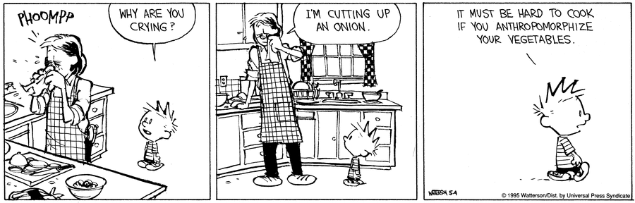

# Pity < Sympathy < Empathy < Compassion

[source](https://www.psychologytoday.com/us/blog/hide-and-seek/201505/empathy-vs-sympathy)

[source](https://medium.com/the-polymath-project/the-abcs-of-fake-empathy-fdbe4555acc5)

## Story

Joe is a junior developer which just joined the company. He has to improve his skills as well as onboard to the company.

Rachel is Joe's superior, she has many other responsibilities and people to manage.

Joe is delayed with delivering his tasks, Rachel is worried that it will cause further delays with other dependant projects.

Rachel invites Joe to a meeting. 

### Pity

Rachel tells Joe she understands it can be hard being less skilled as well as having to onboard to the project and the company.

### Sympathy

Rachel tells Joe she used to be a junior developer as well, so she knows how hard it can be to ramp up your skills and to onboard to a company.

### Empathy

Rachel asks Joe how he is feeling? She listens to him. If he is reluctant to reply she shares some of her own experiences in similar situations, to make her seem more vulnerable.

### Compassion

Rachel tells Joe she will delay the other dependant projects to make sure he feels safe to ramp up his skills and onboard without feeling like he may not be suitable for the job.
