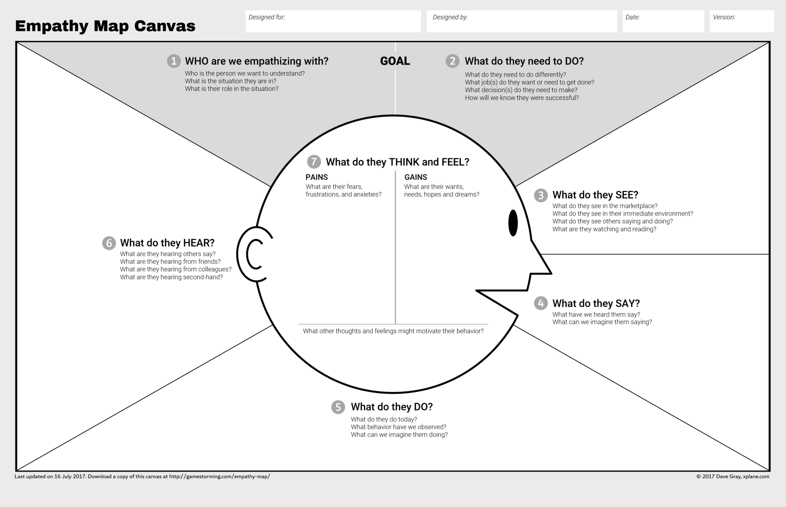

# Practical Empathy

While stories and discussions are cruical to develop empathy for a team, some practical steps can be very useful to asses and decide on appropriate empathic responses.

## Empathy Map

[PDF](Empathy-Map-Canvas-006.pdf)
|
[source](https://medium.com/the-xplane-collection/updated-empathy-map-canvas-46df22df3c8a)

The empathy map is a great tool to try to get into someone elses shoes.

It is fairly self-explanatory, here are some points to consider when using it:

* It's best to use it for a single, specific person (not a generic user or group of people)
* Start with the GOAL section - define who you are empathizing with and what they need to do. These definitions should be framed in terms of observable behaviors.
* Once you defined the goals, continue clockwise and try to understand what they see, say, do and hear. It's important to start from observable behaviours and gradually move towards their inner thoughts and feelings.
* When you know what the person you are empathizing with wants to do and what their external inputs are, you can move on to try and understand what they think and feel. That's the most important part!

To put the empathy map into practical use, try the different [exercises](empathy-exercises/README.md) and use the empathy map to analyse them. This is best via a group discussions - to get as many different viewpoints as possible.
